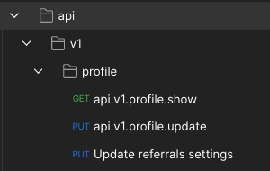
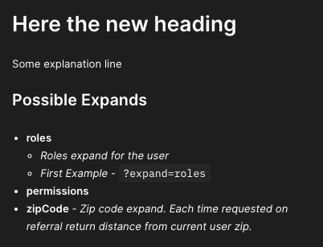

# Postman Documentation Exporter

This package implements powerful postman json exporter in 2.1.1 json version. 

Package integrated with `amondar/rest-actions` right of the box.

> NOTE!!! Please, don't use this exporter for none API routes, that will cause problems with session management during exporting. 

## Installation

To install this package:

- Add to your `composer.json`:
```json
{
  "repositories": [
      {"type": "composer", "url": "https://repo.packagist.com/attractgroup/"}
  ]
}
```
- Authenticate your composer to work with private `attractgroup` repo.
```bash
composer config --global --auth http-basic.repo.packagist.com ${USER} ${AUTH_TOKEN}
```
- Then execute:
```bash
composer require attract-cores/postman-documentation
```

After that you can run artisan command:

```bash
php artisan export:postman
```

All created json docs will be saved at `/storage/app/public/postman/*` directory inside your project.

## Configuration

| Setting | Explanation
| :------ | :----------
| `filename` | Default file pattern is - `{timestamp}_{app}_collection.json`. You can change it into what ever you want. Replacement engine can work with: `{timestamp}`, `{app}`
| `structured` | This flag determine, that json output routes tree should be structured by name\url segments separated via dot(`.`) 
| `oauth_route` | Name of the oauth token issuing route. Works in pair with `auth_type` setting. If your project don't have this kind of route, then set it to `NULL`
| `auth_type` | Type of routes authentication. Works in pair with `auth_middleware`. Accept: `oauth2`, `token`, `none`. [For More information read docs below](#authorization-types-and-tricks) 
| `token_placement` | "Add To" postman option value. Can be only `header` or `query`. Works only via `auth_type=token`
| `auth_middleware` | The name of auth middleware. If route has this middleware, then exporter apply selected `auth_type` setting blocks into route json
| `client_auth_middleware` | The name of client auth middleware. If route has this middleware, then exporter apply `client_credentials` grant authorization
| `auth_clients` | Array of settings that applied into `password` or `client_credentials` grant type authorization
| `scopes` | Array of route patterns to determine which scopes should be applied in `oauth2` type
| `start-user` | Credentials of given user will be used for `password` grant authorization. After exporting, end user can change this credentials for his user
| `headers` | Headers pack, that required for each route
| `enable_formdata` | Enable or disable form data generation for each route. Works in pair with `factories_path`. [For More information read docs below](#form-data-from-form-factories)
| `factories_path` | Path to request form data factories classes
| `include_middleware` | Array of base middlewares, that should be added into export. By default, only `api` middleware used
| `disk` | Disk of storage that should be used for json result file store. By default, `public` driver used

### Authorization types and tricks

Package support several authentication types:
- `oauth2`
- `token`
- `none`

When `none` type used, result routes will be created with empty `auth` blocks. That option preferable on  old projects with custom authentication system.

When `token` type used, result routes will be created with simple `Api Key` authorization option. In that case, end user, after import should place `api_key` into each route manually.

When `oauth2` type used, result routes will be created with `OAuth 2.0` authorization option. Depends on middleware settings `auth_middleware` or `client_auth_middleware` 
will be user `password` or `client_credentials` grant types. On some projects can be implemented anonymous authorization.
In at case you can run command with configured `auth_type=oauth2` and add `--personal-access` option.

```bash
php artinsan export:postman --personal-access={{user_access_token}}
```

In that case will be added `Bearer Token` authorization option to each route. 
That trick can be used on old projects, that used passport, but doesn't have opened `token` route. Just run command as described above without changing.

### Form data from form factories

If  command ran with `enable_formdata=true` then you can specify form factory for each route for each request type: `POST`, `PUT`, `PATCH`, `GET`, `DELETE`. 
By default, all factories should be placed in `./app/Postman` directory. 

Each factory should be named by a pattern below and extends core factory class, just like a standard model factories in laravel:

```bash
${FULL_REQUEST_NAME}Factory.php

#For example

UserProfileRequestFactory.php
```

All factories loaded into memory each time, when command dispatched.

Example of factory class looks like below:

```php
<?php

namespace App\Postman;

use AttractCores\LaravelCoreKit\Http\Requests\UserProfileRequest;
use AttractCores\PostmanDocumentation\Factory\FormRequestFactory;
use Database\Factories\UserFactory;

/**
 * Class UserProfileRequestFactory
 *
 * @package App\Postman
 * Date: 01.12.2021
 * Version: 1.0
 */
class UserProfileRequestFactory extends FormRequestFactory
{

    /**
     * The name of the factory's corresponding form request.
     * @note Value of the $request property can be request class name or route name, 
     * so you can generate name of the factory as you want. 
     * Example - api.v1.profile.update
     * Example - UserProfileRequest::class
     *
     * @var string|null
     */
    protected ?string $request = UserProfileRequest::class;


    /**
     * Define the model's default state.
     *
     * @return array
     */
    public function definition() : array
    {
        return [
            'email'                 => $this->faker->email,
            'password'              => UserFactory::DEFAULT_PASSWORD,
            'password_confirmation' => UserFactory::DEFAULT_PASSWORD,
            'firebase_token'        => NULL,
            'name'                  => $this->faker->name,
        ];
    }

}
``` 

Each factory has initialized `$this->faker` instance, just like model factory in laravel.

If you need dedicated form for each type of REST standard request, then you can add, for example, 
`public function postDefinition()` function and add different from default `definition()` form body.

## Route documentation

Package add several hook methods and classed that can help you generate docs for your routes right in Postman Markdown.
You can export postman collection without any of below tricks, but to make full documentation for your project you need a little more explanations and descriptions. 

### Route tricks

| Hook | Explanation
| :--------- | :----------
| `->aliasedName('My name')` | Works as `->name()` function on route, but add humanized name description for the route in Postman
| `->getAliasedName()` | Return aliased name of the route. This macro function used in the core of the package. Return `NULL` if not set.
| `->structureDepth(3)` | This macro function will set structure depth for given route. For example, you have this routes: `api.v1.profile.show`, `api.v1.profile.update` and `api.v1.profile.referral-settings.update`. If we run export as is, then last route will be added into separate group in structure, cuz it base segments count longer then other profile route. We can use described marco to say tree builder which depth of three on given route we want. In example case it will be `->structureDepth(3)` and tree builder will use `api.v1.profile` as structure base. 
| `->getStructureDepth()` | Return depth that was set or `NULL` 
| `->expands()` | Set documentation block based on Sextant or Filter packages implemented in given model class expands. For example, `->expands(App\Models\User::class, [ 'roles' => [ '*Roles expand for the user*', '*First Example* - `?expand=roles`' ], 'zipCode' => 'Zip code expand. Each time requested on referral return distance from current user zip.' ])`. As you can see you can add text description for each expand as string or as array if you need nested list  
| `->scopes()` | Set documentation block based on Sextant or Filter packages implemented in given model class scopes. Can be used same as expands - `->scopes($modelClass, array of descriptions)`  
| `->description()` | Set documentation block based on coder needs. This function accept one parameter: `Markdown` facade class instance.   
| `->docPattern()` | Set route documentation pattern. By default this patter set to **->docPattern('description&vert;expands&vert;scopes')**. You can change ordering of doc blocks as you wish  
| `->compileDocs()` | Return compiled Markdown string of route docs.  


Example of usage:

```php
<?php
use AttractCores\PostmanDocumentation\PostmanAction;

Route::put('profile/referrals-settings', 'Api\ReferralsSettingsController@update')
     ->name('profile.referrals-settings.update')
     ->aliasedName('Update referrals settings')
     ->structureDepth(3)
     ->expands(App\Models\User::class, [
         'roles'   => [
             '*Roles expand for the user*',
             '*First Example* - `?expand=roles`',
         ],
         'zipCode' => 'Zip code expand. Each time requested on referral return distance from current user zip.',
     ])
     ->scopes(App\Models\User::class)
     ->description(
         \AttractCores\PostmanDocumentation\Facade\Markdown::heading('Here the new heading')
                                                           ->line('Some explanation line')
     );

// OR via resource

Route::apiResource('users', 'UserController')
      ->postman([
          'index'   => PostmanAction::fresh()
                                    ->aliasedName('Get list of users')
                                    ->expands(CoreUserContract::class),
          'show'    => PostmanAction::fresh()
                                    ->aliasedName('Get one user resource')
                                    ->expands(CoreUserContract::class),
          'store'    => PostmanAction::fresh()
                                    ->aliasedName('Create new user'),
          'update'     => PostmanAction::fresh()
                                    ->aliasedName('Update existing user'),
          'destroy' => PostmanAction::fresh()
                                    ->aliasedName('Delete existing user'),
      ]);
```
`PostmanAction` can use same functions as on simple `Route` to set settings and descriptions on resources. 

This example will generate structure as described below:



Documentation will look like:



### Markdown

Package implements `MarkdownDocs` class. That class can easily create markdown syntax with pretty functions structure, 
like laravel Email class.

| Function | Explanation
| :--------- | :----------
| `->heading('My heading', 'h1')` | Create heading element in markdown syntax. Second parameter is optional, by default, it equals to `h1`. You can set second parameter to: `h1`, `h2`, `h3`, `h4`, `h5`, `h6`. For example, `h5` create heading with five `#####`
| `->line('My line', 'prefix here')` | Create simple paragraph element. Second parameter is optional. Second parameter accept prefix or the line. For example you want create a quote you can send `>` symbol into second parameter
| `->quote(['First qoute', 'Second quote'])` | Create multiline quotes
| `->numericList(['First plan line' => ['First sub plan', 'Second sub plan'], 'Second plan line'])` | Create multi-dimensional numeric list
| `->unorderedList(['First plan line' => ['First sub plan', 'Second sub plan'], 'Second plan line'])` | Create multi-dimensional unordered list
| `->block('php artisan tinker', 'bash')` | Create language block. First parameter can be used as new `MarkdownDocs` class instance. String conversion will work automatically 
| `->link('some_link_or_local_git_path', 'Here is a link')` | Insert link into markdown string 
| `->image('some_image_link_or_local_git_path', 'Here is an image')` | Insert image into markdown string
| `->raw('Some raw markdown string or result of other Markdown class instance')` | Insert given string as is

You can use `->raw` functionality to insert result of another markdown class instance:

```php
Markdown::raw(Markdown::new()->line('Some another configured line'));
```


